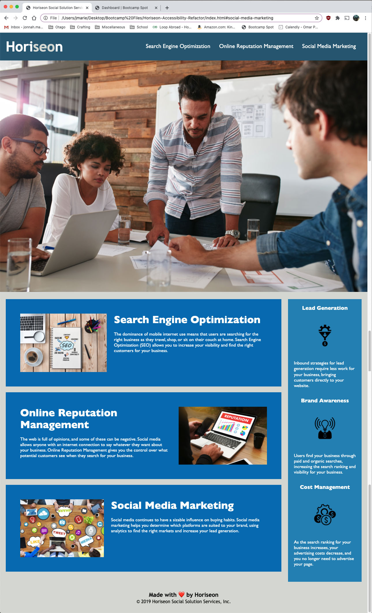

# Horiseon Accessibility Refactoring Project

This project aimed to make an existing site more accessible to those with disabilities. The original coding made use of division elements through its entirety. Accessibility was achieved by using semantic elements, such as headers, footers, sections, and asides. 2 division elements were used as wrappers to contain both the section and asides elements.

```
alt=""
```

Alternative text attributes in the image tags were added but not implemented with appropriate text because the images on the web page did not provide any further information that the main text could not give. They were simply decorative.



[Live Website](https://jonnahmarie.github.io/Horiseon-Accessibility-Refactor/)